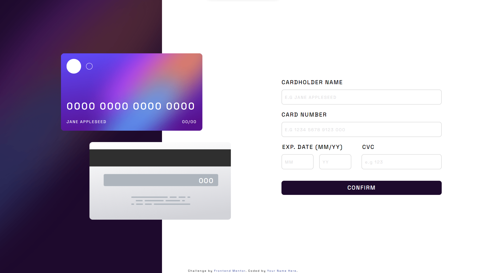

# Frontend Mentor - Interactive card details form solution

This is a solution to the [Interactive card details form challenge on Frontend Mentor](https://www.frontendmentor.io/challenges/interactive-card-details-form-XpS8cKZDWw). Frontend Mentor challenges help you improve your coding skills by building realistic projects.

## Table of contents

- [Overview](#overview)
  - [The challenge](#the-challenge)
  - [Screenshot](#screenshot)
  - [Links](#links)
- [My process](#my-process)
  - [Built with](#built-with)
  - [What I learned](#what-i-learned)
  - [Continued development](#continued-development)
  - [Useful resources](#useful-resources)
- [Author](#author)
- [Acknowledgments](#acknowledgments)

**Note: Delete this note and update the table of contents based on what sections you keep.**

## Overview

### The challenge

Users should be able to:

- Fill in the form and see the card details update in real-time
- Receive error messages when the form is submitted if:
  - Any input field is empty
  - The card number, expiry date, or CVC fields are in the wrong format
- View the optimal layout depending on their device's screen size
- See hover, active, and focus states for interactive elements on the page

### Screenshot

### Links

- Solution URL: [My solution](https://your-solution-url.com)
- Live Site URL: [Live URL](https://your-live-site-url.com)

## My process

### Built with

- Semantic HTML5 markup
- CSS custom properties
- Flexbox
- CSS Grid
- Mobile-first workflow
- Vanilla Javascript

### What I learned

This was a very hard challenge. Through this challenge I learnt about Regular Expression.
Furthermore, updating user real time interaction is fairly hard. Luckily, I managed to use splice() effectively.

Regular Expression can be very powerful if you know how to use them.

### Continued development

Definitely looking into React.js now. I feel like Frontend Mentor Challenges are super interesting to solve. Especially I always have smart people to help me when I get stuck :D

## Author

- Frontend Mentor - [@yourusername](https://www.frontendmentor.io/profile/RaidEyes)

## Acknowledgments

Special Thanks to ThuTrang5631. She collaborated with me through this tough challenge.
We learnt many things after working with each other. Thanks Trang!!
